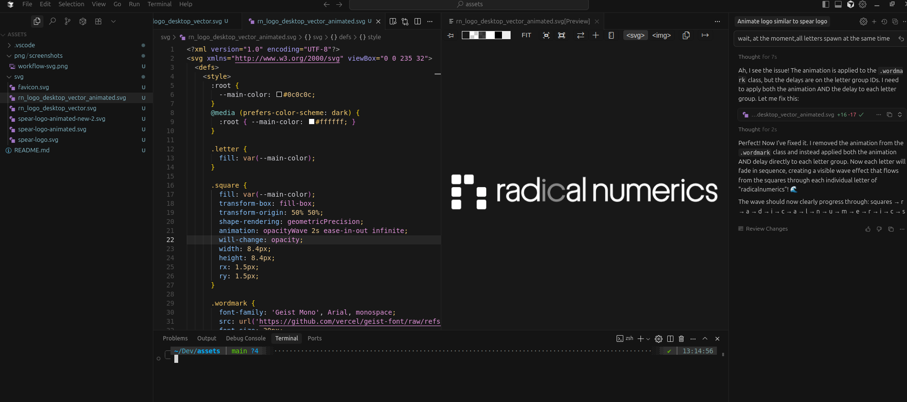

# Radical Numerics Assets (WIP)

This repository contains the assets (such as svg, png, etc.) for Radical Numerics. 

## SVGs

SVGs are meant to be easy to use, lightweight, and easy to modify -- this includes smooth vector animations without the need for wasteful GIFs!

### Development

We recommend using Cursor/VSCode to edit them, which allows to use agents to edit them:

1. Install the [SVG extension by jock](https://marketplace.cursorapi.com/items/?itemName=jock.svg): go to Extensions -> Search for "SVG" -> Install the extension by jock.
2. Open the SVG file in with a text editor (right click -> Open with -> text editor). You can also set the text editor as default for `*.svg` files.
3. Right click on the SVG file -> Preview SVG. This way you can edit the code and see the result in real time as in the below screenshot:

Example vectorized logo:

  

Example animation:

  

